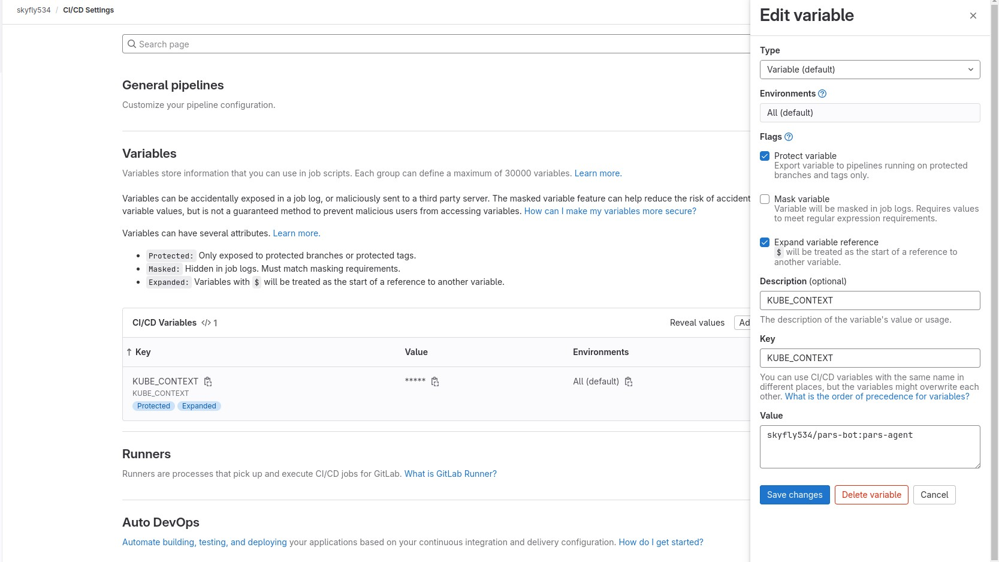
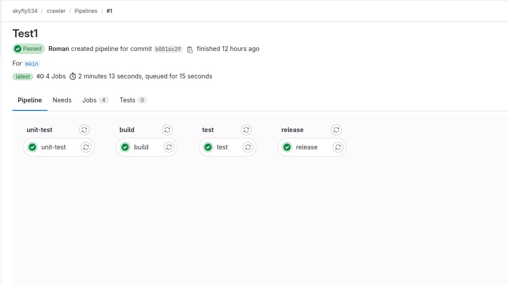
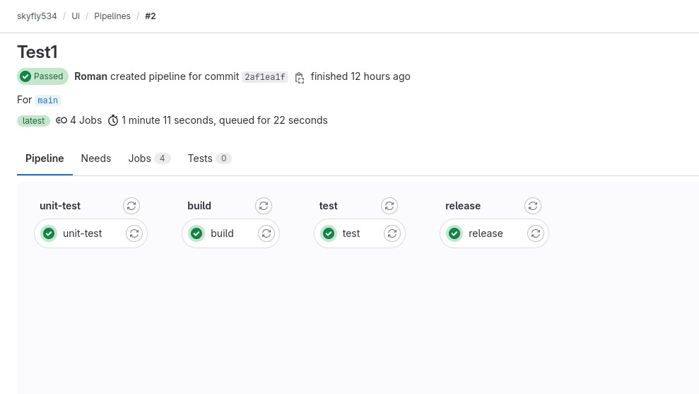
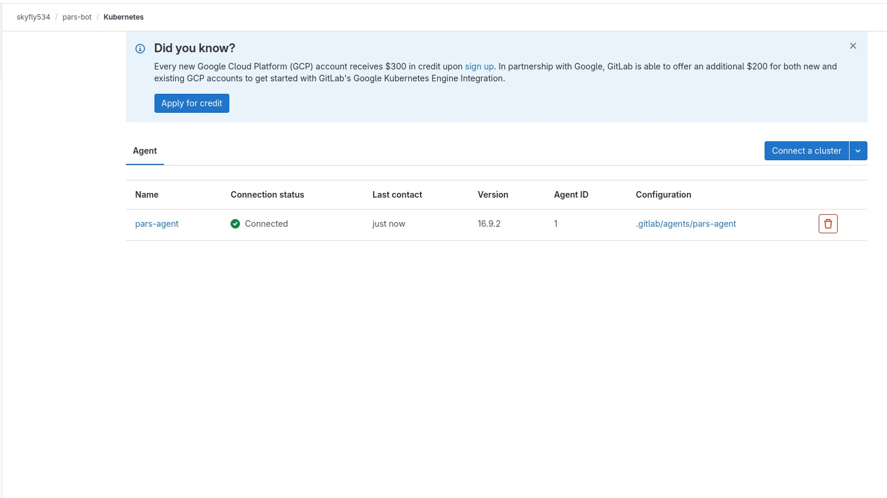
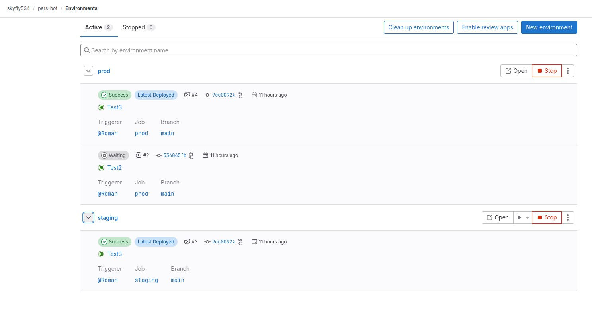
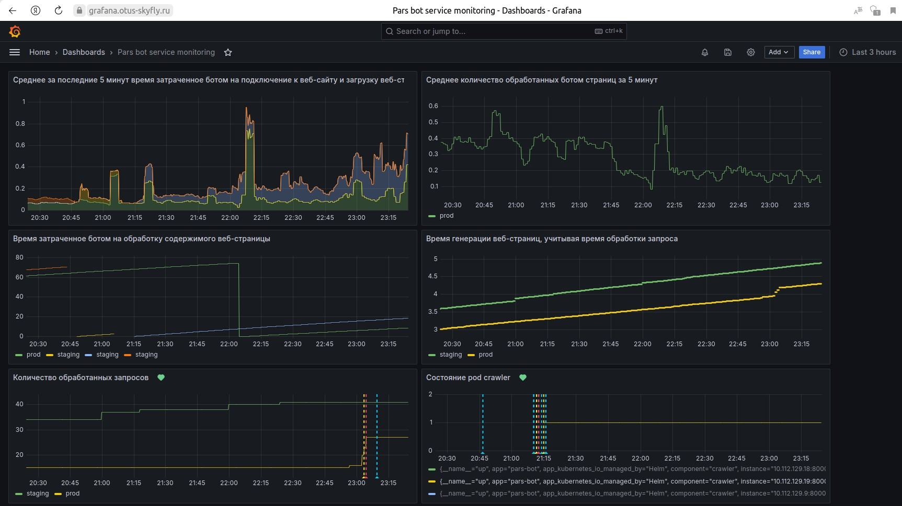
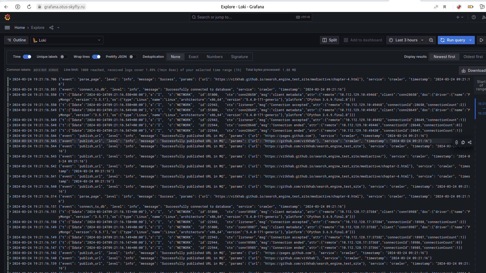
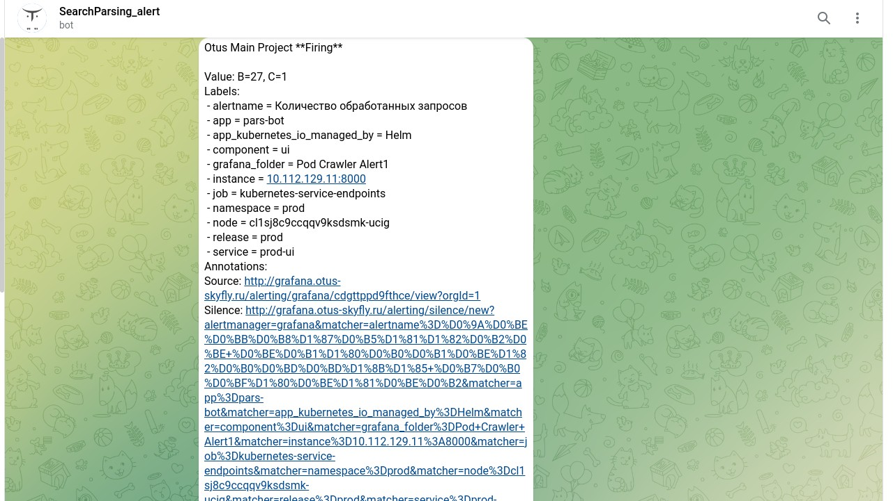
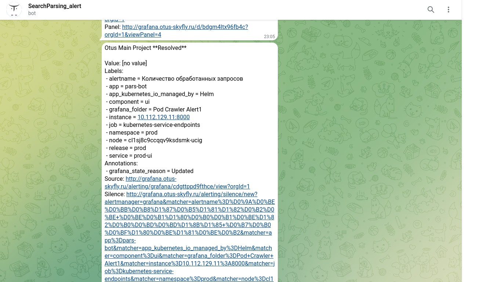

# Тема: «Создание процесса непрерывной поставки для приложения с применением практик CI/CD и IaC на базе Kubernetes развернутого на ресурсах облачной платформы и быстрой обратной связью»

### Дано:

Микросервисное приложение:

- База данных (`mongodb`)

- Менеджер очередей сообщений (`RabbitMQ`)

- [Search Engine Crawler](https://github.com/express42/search_engine_crawler)

- [Search Engine UI](https://github.com/express42/search_engine_ui?tab=readme-ov-file#search-engine-ui)

- [Пример сайта для парсинга](https://vitkhab.github.io/search_engine_test_site/) .


Схема приложения
### Требования:

- Автоматизация процессов создания и управления платформой:

  - Размещение инфраструктуры на ресурсах облачной платформы (`Yandex Cloud`)

  - Развернута инфраструктура для `CI/CD`

  - Развернута инфраструктура для сбора обратной связи  (сбор метрик, алертинг, визуализация)

- Все технологические процессы для управления конфигурацией и инфраструктурой реализованы с использование практики `IaC` (Infrastructure as Code) 

- Настроен процесс непрерывной поставки `CI/CD`

- Подготовлена документация: 

  - `README` по работе с репозиторием

  - Описание приложения и его архитектуры

  - Мануал по запуску приложения

## Реализация:

1. Подготовлен `./src/search_engine_crawler/Dockerfile` для сборки образа контейнера поискового бота [Search Engine Crawler](https://github.com/express42/search_engine_crawler);

При сборке образа в Dockerfile задаются значения по умолчанию для сканируемого тестового сайта (передается в качестве аргумента командной строки через `CMD`) и маска для исключения (переменная среды `EXCLUDE_URLS`):

```
FROM alpine:3.9

WORKDIR /app/
COPY ./ ./

RUN set -x \
 && apk --no-cache --update add python3 py3-pip \
 && pip3 install --no-cache-dir -r requirements.txt

ENV EXCLUDE_URLS=.*github.com

ENTRYPOINT [ "python3", "-u", "crawler/crawler.py" ]
CMD [ "https://vitkhab.github.io/search_engine_test_site/" ]
```

2. Подготовлен `./src/search_engine_ui/Dockerfile` для сборки образа контейнера веб-интерфейса [Search Engine UI](https://github.com/express42/search_engine_ui?tab=readme-ov-file#search-engine-ui);


3. При помощи манифестов `Terraform` в `Yandex Cloud` произведена установка двух кластеров `Kubernetes`;

В кластере `skyfly535` разворачиваем инфраструктуру CI/CD - `GitLab`.

В кластер `pars-bot` будет производится выкатка самого приложения, развертывание всей необходимой инфраструктуры (monitorin, cert-cert manager).

```
./kubernetes/terraform_YC_k8s$ terraform apply -auto-approve

./kubernetes/terraform_YC_parsbot$ terraform apply -auto-approve
```
Регистрируем локально

```
$ yc managed-kubernetes cluster get-credentials skyfly535 --external
```

4. Установлен `Gitlab` с помощью `Helm Chart’а`;

Добавляем репозиторий Gitlab и качаем чарт

```
$ helm repo remove bitnami

$ helm repo add gitlab https://charts.gitlab.io/

$ helm repo update

$ helm pull gitlab/gitlab --untar
```
В файле `values.yaml` (в корне скаченного чата) редактируем следующие поля:

```
global:
     labels: {}

   ## https://docs.gitlab.com/charts/installation/deployment#deploy-the-community-edition
-  edition: ee
+  edition: ce

   ## https://docs.gitlab.com/charts/charts/globals#gitlab-version
   # gitlabVersion:
global:
       certName: "tls.crt"

   ## Timezone for containers.
-  time_zone: UTC
+  time_zone: Asia/Vladivostok

 ## Settings to for the Let's Encrypt ACME Issuer
-# certmanager-issuer:
+certmanager-issuer:
 #   # The email address to register certificates requested from Let's Encrypt.
 #   # Required if using Let's Encrypt.
-#   email: email@example.com
+  email: OtusProject2024@mail.com

 ## Installation & configuration of jetstack/cert-manager
 ## See requirements.yaml for current version
 nginx-ingress:
 ## Installation & configuration of stable/prometheus
 ## See requirements.yaml for current version
 prometheus:
-  install: true
+  install: false
   rbac:
     create: true
   alertmanager:

hosts:
-    domain: example.com
+    domain: otus-skyfly.ru
     hostSuffix:
     https: true
-    externalIP:
+    externalIP: 158.160.37.223
     ssh: ~
     gitlab: {}
     minio: {}
```
Производим установку

```
$  helm install gitlab ./gitlab
```
После завершения установки GitLab будет доступен по адресу: 

https://gitlab.otus-skyfly.ru/

Для первого входа необходимо узнать токен для `root`

```
$  kubectl get secret gitlab-gitlab-initial-root-password -ojsonpath='{.data.password}' | base64 --decode ; echo
```
После входа создан пользователь с правами `Admin` и для взаимодействия с GitLab созданному пользователю помещена открытая часть `ssh ключа`.

Создана публичная группа `skyfly534`. 

В свойствах группы в пункте `CI/CD`, добавлена переменная `KUBE_CONTEXT` (skyfly534/pars-bot:pars-agent) с именем контекста Kubernetes кластера для подключения из GitLab Runner'ов (определена для группы проектов skyfly534).



5. В группе skyfly534 созданы два публичных проекта `crawler` и `ui`, в них запушино два локальных репозитория `./src/search_engine_crawler` и `./src/search_engine_ui` соответственно;

В данных локальных репозиториях содержаться файлы кода микросервисов, пайплайны сборки, Dockerfile.

После пуша в каждом проекте запускается CI/CD пайплайн содержащий следующие стадии:

  - unit-test - тестирование и генерация отчета о покрытии кода тестами;

  - build - сборка образа и размещение в Container Registry с тэгом ${CI_COMMIT_SHA};

  - test - шаг для тестирования образа;

  - release - публикация в Container Registry нашего GitLab образа микросервиса с тэгами latest и версией, взятой из файла VERSION.

`release` выполняется только при внесении изменений в ветку `main`.



Пайплайн crawler



Пайплайн ui

6. В группе skyfly534 создан публичный проект `pars-bot` в него запушин файл `.gitlab/agents/pars-agent/config.yaml` из локального репозитория `./kubernetes/parsing/Charts/` для создания `GitLab Agent` с помощью которого будем выкатывать выше описанную инфраструктуру на кластер `pars-bot`;

```
ci_access:
  groups:
    - id: skyfly534
```
Агент авторизуется для проектов нашей группы.

7. Произведена локальная регистрация и первичная настройка кластера `pars-bot`;

Устанавливаем `Ingress-NGINX` контроллер из официального Helm Chart'а

```
helm upgrade --install ingress-nginx ingress-nginx \
  --repo https://kubernetes.github.io/ingress-nginx \
  --namespace ingress-nginx --create-namespace
```
Устанавливаем подключения Gitlab агента при помощи сгенерированных команды для установки в интерфейсе Gitlab (проект pars-bot --> Infastucture/Kubernetes cluster --> Connect a cluster)

```
$ helm repo add gitlab https://charts.gitlab.io
$ helm repo update
$ helm upgrade --install reddit-agent gitlab/gitlab-agent \
    --namespace gitlab-agent \
    --create-namespace \
    --set image.tag=v16.9.2 \
    --set config.token=szv2u9_uHzy85zpdoTtdP9u15QKf93m2jui18DMDJbfDBfzL2w \
    --set config.kasAddress=wss://kas.otus-skyfly.ru.
```



Статус подключенного агента в GitLab

8. В группе skyfly534 создан публичный проект `cert-manager` в него пушим файлы локального репозитория `./kubernetes/cert-manager` для развертывание в кластере `pars-bot` дополнения Cert-manager и объявления ресурсов центров сертификации (CA) типа `ClusterIssuer`;

Подключение к веб-интерфейсам приложения и системы мониторинга осуществляется через сетевой балансировщик на базе контроллера Ingress-NGINX по протоколу https с использованием `TLS` сертификатов `Let's Encrypt`.

ClusterIssuer используется т.к. данный ресурс является глобальным объектом кластера, и область его видимости распространяется на все пространства имен.

Пайплайн содержит следующие стадии:

deploy - развернуть, или обновить Cert-manager;

apply - применить манифесты ресурсов ClusterIssuer.

Для уменьшит шансов столкнуться с ограничениями по лимиту выпуска доверенных сертификатов для окружения `staging` в файле `./kubernetes/cert-manager/issuers.yaml`.
используем следующий URL-адрес ACME 

```
...

spec:
  acme:
    # The ACME server URL
    server: https://acme-staging-v02.api.letsencrypt.org/directory
...
```
для `prod` используем "боевой"

```
...

spec:
  acme:
    # The ACME server URL
    server: https://acme-v02.api.letsencrypt.org/directory
...
```
[Официальная документация Let's Encrypt](https://letsencrypt.org/ru/docs/staging-environment/)

9. Производим пуши остальных файлов локального репозитория `./kubernetes/parsing/Charts/` для развертывания приложения в двух окружениях `staging` и `prod`;

Каждый из необходимых микросервисов `crawler`, `ui`, `mongodb` и `rabbitmq` шаблонизированы при помощи `Helm Chart`. 

Для запуска приложения целиком создан общий чарт в каталоге reddit `./kubernetes/parsing/Charts/pars-bot/`

requirements.yaml (файл описания зависимостей для запуска основного Chart):

```
---
dependencies:
  - name: crawler
    version: "1.0.0"
    repository: "file://../crawler"

  - name: mongodb
    version: "1.0.0"
    repository: "file://../mongodb"

  - name: rabbitmq
    version: "1.0.0"
    repository: "file://../rabbitmq"

  - name: ui
    version: "1.0.0"
    repository: "file://../ui"

```

Chart.yaml:

```
---
apiVersion: v1
appVersion: 1.0.0
name: pars-bot
version: 1.0.0
description: OTUS Main Project pars-bot application
maintainers:
  - name: RKozlovsky
    email: Roman@Kozlovsky.com
```

В локальном репозитории `./kubernetes/parsing/Charts/` содержится файл пайплайна `.gitlab-ci.yml` для организации непрерывной поставки приложения.

Пайплайн содержит следующие стадии:

- `test` - шаг для тестирования образа;

- `staging` - шаг развертывания приложения в одноименные пространстве имен Kubernetes. URL адрес для окружения формируется автоматически из встроенных переменных `CI_ENVIRONMENT_SLUG` и `CI_PAGES_DOMAIN`. Для окружения автоматически генерируется Let's Entrypt TLS сертификат через Cert-manager. Выполняется только при публикации в ветку main.;
 
- `prod`- шаг выполняется вручную. Аналогично предыдущему шагу с той разницей, что запуск осуществляется вручную.



Environments GitLab нашего приложения

Адрес приложения выпущенного в `staging` окружении:

### https://staging.pages.otus-skyfly.ru/

Адрес приложения выпущенного в `prod` окружении:

### https://prod.pages.otus-skyfly.ru

10. В группе skyfly534 создан публичный проект `monitoring` в него пушим файлы одноименного локального репозитория `./kubernetes/monitoring` для настройки процесса сбора обратной связи.

Исходные данные сервисов `crawler` и `ui`:

- метрики для снятия `prometheus` доступны по адресу http://HOST_IP:8000/ (где HOST_IP адрес хоста на котором запущен бот);

- метрики сервиса `crawler`:

  - crawler_pages_parsed - количество обработанных ботом страниц

  - crawler_site_connection_time - время затраченное ботом на подключение к веб-сайту и загрузку веб-страницы

  - crawler_page_parse_time - время затраченное ботом на обработку содержимого веб-страницы

- метрики сервиса `ui`:

  - web_pages_served - количество обработанных запросов

  - web_page_gen_time - время генерации веб-страниц, учитывая время обработки запроса

- Бот отправляет логи в json-формате в stdout.

В аннотациях метаданных сервисов задаются параметры сбора метрик для Prometheus:

```
...
metadata:
  annotations:
    prometheus.io/scrape: "true"
    prometheus.io/path: "/metrics"
    prometheus.io/port: "{{ .Values.service.externalPort }}"
...
```

Локальный репозиторий `./kubernetes/monitoring` содержит пайплайн для развертывания  стека `loki-stack` из Helm Chart от `Grafana` в неймспейсе `monitoring`, файл `values.yaml` с параметрами для развертывания стека и каталог `grafana-export` с файлами `crawler-UI-dashboard.json` (дашборды Grafana), `TG-evaluation-group.yaml` (алерты для оповещения в Telegram).

URL Grafana: https://grafana.otus-skyfly.ru/


Дашборд метрик сервисов


Отображение логов собранных сервисом `loki` в интерфейсе Grafana

Для уведомлений алертинга в Grafana настроена `Contact point` с интеграцией в Telegram. 


Состояние `Firing`


Состояние `Resolved`
